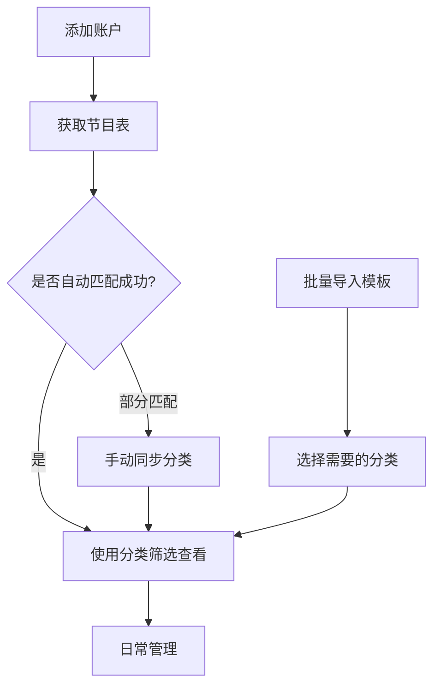

# 广东IPTV频道智能匹配系统 - 完整指南

## 🌟 系统概述

本系统实现了**电信IPTV接口与频道模板库的智能匹配**，可自动为176个广东电信频道补充分类信息。

### 核心优势
✅ 电信接口返回的`ChannelID` → 自动匹配模板库的`channel_id`  
✅ 自动补充频道分类（广东、央视、卫视等6大分类）  
✅ 统一频道名称（去除"高清"、"HD"等后缀）  
✅ 支持批量导入、智能筛选、手动同步  

---

## 📚 频道模板库

### 模板统计
```
总频道数：176个
├─ 广东：67个（广东卫视、珠江、新闻等）
├─ 央视：39个（CCTV-1~17、数字频道等）
├─ 卫视：34个（湖南、浙江、江苏等）
├─ 其他：20个（教育、金鹰等）
├─ 4K超高清：12个
└─ 付费：4个
```

### 匹配原理
```mermaid
电信接口返回
   ↓
ChannelID: "6197"
ChannelName: "广东卫视高清"
   ↓
匹配模板库 (channel_id: "6197")
   ↓
补充信息
├─ name: "广东卫视"（标准名称）
└─ group_title: "广东"（分类）
   ↓
保存到数据库
```

---

## 🚀 使用场景

### 场景1：新账户获取频道（推荐）⭐

**适用：首次添加账户，需要获取节目表**

1. **添加账户** → "账户管理" → "添加账户"
2. **获取节目表** → "直播源管理" → 选择账户 → "获取节目表"
3. **自动匹配** → 系统自动匹配176个模板频道，补充分类
4. **查看结果** → "频道管理" → 使用分类筛选查看

**优点**：
- 🎯 一步到位，无需手动操作
- 📊 自动分类，方便管理
- ⚡ 高效快速

**日志示例**：
```
[INFO] 成功保存 176 个频道，其中 176 个匹配到模板库
```

---

### 场景2：批量导入模板频道

**适用：直接导入标准频道，无需连接电信接口**

#### 步骤说明

1. **进入频道管理页面**
   ```
   左侧菜单 → 频道管理
   ```

2. **查看模板库统计**
   - 顶部显示：`176 模板频道总数`
   - 分类标签：`广东(67) 央视(39) 卫视(34)...`

3. **点击"批量导入频道"**
   - 蓝色按钮，右上角

4. **配置导入设置**

   | 字段 | 说明 | 示例 |
   |------|------|------|
   | 选择账户 * | 频道将导入到此账户下 | test@iptv.gd |
   | 源名称 * | 创建或使用的源名称 | 广东IPTV |
   | 选择分类 * | 点击分类按钮选择（可多选） | 广东 + 央视 |
   | 覆盖已存在 | 是否覆盖已有频道 | ☐ |

5. **查看预览**
   ```
   ℹ️ 将导入 106 个频道
   ```

6. **开始导入**
   - 点击"开始导入"按钮
   - 等待导入完成

7. **查看结果**
   ```
   ✅ 成功导入 106 个频道
   ```

#### 分类选择技巧

**场景示例**：

```
只需要本地频道：
☑️ 广东 (67个)

完整央视套餐：
☑️ 央视 (39个)

基础+卫视组合：
☑️ 广东 (67个)
☑️ 央视 (39个)  
☑️ 卫视 (34个)

全部导入：
☑️ 所有分类
```

---

### 场景3：同步已有频道分类

**适用：已有频道数据，但缺少分类信息**

#### 使用场景
- 📂 从其他系统导入的频道
- 🔄 早期版本创建的频道（无分类）
- 🆕 模板库更新后需要重新匹配

#### 操作步骤

1. **选择账户**
   ```
   频道管理 → 所有账户 ▼ → 选择目标账户
   ```

2. **点击"同步分类"按钮**
   - 蓝绿色按钮，位于"刷新"按钮旁边

3. **确认同步**
   ```
   提示：将根据频道ID自动匹配模板库，更新频道名称和分类信息。
         是否继续？
   
   [确定] [取消]
   ```

4. **等待处理**
   ```
   ⏳ 正在同步分类信息...
   ```

5. **查看结果**
   ```
   ✅ 同步完成！更新了 150 个频道
   ```

#### 同步规则

| 情况 | 处理方式 |
|------|---------|
| channel_id匹配成功 | ✅ 更新名称 + 分类 |
| channel_id未匹配 | ⏭️ 跳过，保持原样 |
| 分类已存在 | ⏭️ 跳过（可选：勾选覆盖） |

---

## 🎨 界面功能详解

### 1. 频道模板库卡片

```
┌──────────────────────────────────────────────┐
│ 📦 频道模板库              [批量导入频道]   │
├──────────────────────────────────────────────┤
│  176                                         │
│  模板频道总数                                │
│                                              │
│  广东(67) 央视(39) 卫视(34) 其他(20)        │
│  4K超高清(12) 付费(4)                       │
└──────────────────────────────────────────────┘
```

**功能**：
- 📊 实时显示模板库统计
- 🏷️ 分类标签快速预览
- 🔵 一键打开批量导入

---

### 2. 频道列表工具栏

```
[所有分类 ▼] [所有账户 ▼] [🔄 刷新] [🔁 同步分类] [🗑️ 批量删除]
```

| 按钮 | 功能 | 快捷键 |
|------|------|--------|
| 所有分类 ▼ | 按分类筛选频道 | - |
| 所有账户 ▼ | 按账户筛选频道 | - |
| 🔄 刷新 | 重新加载频道列表 | - |
| 🔁 同步分类 | 自动匹配更新分类 | - |
| 🗑️ 批量删除 | 删除选中的频道 | 选中后显示 |

---

### 3. 频道列表表格

```
☑  ID  频道ID  频道名称    关联账户        分类  状态  操作
☐  1   6197   广东卫视    test@iptv.gd   广东  启用  [🗑️]
☐  2   8378   广东珠江    test@iptv.gd   广东  启用  [🗑️]
...
```

**功能**：
- ☑️ 全选/单选复选框
- 🔍 多维度筛选（分类 + 账户）
- 📊 状态显示（启用/停用）
- 🗑️ 单个删除

---

## 📖 高级功能

### 1. 分类筛选组合

**示例**：只查看特定账户的央视频道

```
步骤：
1. 所有分类 → 选择"央视"
2. 所有账户 → 选择"test@iptv.gd"
3. 点击"刷新"

结果：只显示该账户的39个央视频道
```

---

### 2. 批量删除

**场景**：清理测试数据或重复频道

```
步骤：
1. 勾选要删除的频道（或全选）
2. 点击"批量删除"按钮
3. 确认删除

提示：批量删除不可恢复，请谨慎操作！
```

---

### 3. 自定义分类

**如果模板库没有您的频道**：

方法1：手动编辑 `public/data.json`
```json
{
  "id": 177,
  "channel_id": "新的频道ID",
  "name": "新频道名称",
  "group_title": "自定义分类"
}
```

方法2：在界面中手动设置分类
```
频道列表 → 操作 → 编辑 → 修改分类字段
```

---

## 🔧 技术说明

### API端点

#### 1. 获取模板库
```http
GET /api/channel-template/templates

Response:
{
  "data": {
    "total": 176,
    "categories": {
      "广东": 67,
      "央视": 39,
      ...
    },
    "channels": [...]
  }
}
```

#### 2. 批量导入
```http
POST /api/channel-template/import

Request Body:
{
  "account_id": 1,
  "source_name": "广东IPTV",
  "categories": ["广东", "央视"],
  "overwrite": false
}

Response:
{
  "message": "频道导入完成",
  "data": {
    "imported": 106,
    "skipped": 0,
    "source_id": 2
  }
}
```

#### 3. 同步分类
```http
POST /api/channel-template/sync-categories/{source_id}

Response:
{
  "message": "分类同步完成",
  "data": {
    "updated": 150,
    "skipped": 26
  }
}
```

---

### 数据库字段

#### channels 表
| 字段 | 类型 | 说明 |
|------|------|------|
| channel_id | TEXT | 电信接口的频道ID |
| channel_name | TEXT | 标准频道名称 |
| category | TEXT | **自动补充的分类** ⭐ |
| channel_url | TEXT | 播放URL |
| ... | | 其他字段 |

---

## 💡 最佳实践

### 推荐工作流程



### 性能优化建议

1. **批量导入**：按分类逐步导入，避免一次性导入所有176个频道
2. **定期同步**：模板库更新后，使用"同步分类"功能批量更新
3. **分类筛选**：使用分类筛选减少列表加载时间

---

## ❓ 常见问题

### Q1: 为什么有些频道没有匹配到分类？
**A**: 
- 原因：频道ID不在模板库中（可能是地方特色频道）
- 解决：
  1. 手动编辑 `public/data.json` 添加
  2. 或在界面中手动设置分类

### Q2: 导入会覆盖已有频道吗？
**A**: 
- 默认不会覆盖
- 如需覆盖，勾选"覆盖已存在的频道"选项

### Q3: 同步分类会影响播放URL吗？
**A**: 
- 不会！只更新`channel_name`和`category`字段
- 不影响`channel_url`、`channel_id`等其他字段

### Q4: 可以导入部分频道吗？
**A**: 
- 可以！通过选择分类实现
- 例如只选择"广东"分类，只导入67个广东频道

### Q5: 如何查看某个频道是否匹配成功？
**A**: 
- 方法1：查看日志（显示匹配统计）
- 方法2：查看频道列表的"分类"列
  - 有分类 = 匹配成功
  - 显示"-" = 未匹配

---

## 📝 更新日志

### v2.0 - 智能匹配系统
- ✅ 集成176个广东IPTV频道模板库
- ✅ 自动匹配电信接口频道ID
- ✅ 批量导入功能
- ✅ 分类同步功能
- ✅ 分类筛选功能

---

## 🎉 总结

通过本系统，您可以：

1. 🚀 **自动化**：获取频道时自动匹配分类
2. 📦 **批量导入**：一键导入标准频道模板
3. 🔄 **智能同步**：手动触发分类更新
4. 🔍 **精准筛选**：按分类和账户快速查找
5. 🛠️ **灵活管理**：支持批量操作和自定义

**立即开始使用吧！** 🎊
